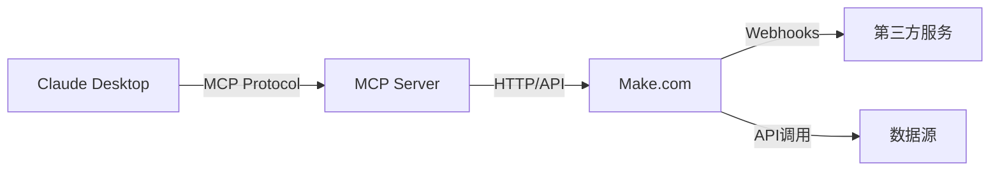

# Make.com MCP Server Integration Guide

## 概述

本指南详细介绍如何将 Make.com（原 Integromat）集成为 MCP (Model Context Protocol) server，使 Claude Desktop 能够直接连接和使用 Make.com 的自动化功能。

## 目录

- [什么是 MCP](#什么是-mcp)
- [Make.com 简介](#makecom-简介)
- [集成架构](#集成架构)
- [前置条件](#前置条件)
- [实现步骤](#实现步骤)
- [Claude Desktop 配置](#claude-desktop-配置)
- [使用示例](#使用示例)
- [故障排除](#故障排除)
- [最佳实践](#最佳实践)

## 什么是 MCP

Model Context Protocol (MCP) 是一个开放标准，允许 AI 助手安全地连接到外部数据源和工具。通过 MCP，Claude Desktop 可以：

- 访问实时数据
- 执行外部操作
- 与第三方服务交互
- 扩展功能边界

## Make.com 简介

Make.com 是一个强大的无代码自动化平台，支持：

- 1000+ 应用集成
- 复杂的工作流设计
- 实时数据处理
- API 和 Webhook 支持

## 集成架构



## 前置条件

1. **Make.com 账户**
   - 有效的 Make.com 订阅
   - API 访问权限

2. **开发环境**
   - Node.js 18+ 或 Python 3.8+
   - 基本的编程知识

3. **Claude Desktop**
   - 最新版本的 Claude Desktop 应用
   - MCP 功能已启用

## 实现步骤

### 步骤 1: 设置 Make.com API 访问

1. 登录 Make.com 控制台
2. 导航到 **设置 > API**
3. 创建新的 API 令牌
4. 保存令牌用于后续配置

### 步骤 2: 创建 MCP Server

创建一个新的 MCP server 项目：

```bash
mkdir make-mcp-server
cd make-mcp-server
npm init -y
npm install @anthropic-ai/mcp-server axios dotenv
```

### 步骤 3: 实现 MCP Server 代码

创建 `src/server.js`：

```javascript
import { Server } from "@anthropic-ai/mcp-server";
import axios from "axios";
import dotenv from "dotenv";

dotenv.config();

class MakeMCPServer {
  constructor() {
    this.server = new Server("make-integration");
    this.makeApiUrl = "https://eu1.make.com/api/v2";
    this.apiToken = process.env.MAKE_API_TOKEN;
    
    this.setupHandlers();
  }

  setupHandlers() {
    // 获取场景列表
    this.server.setRequestHandler("tools/list", async () => ({
      tools: [
        {
          name: "list_scenarios",
          description: "获取所有可用的 Make.com 场景",
          inputSchema: {
            type: "object",
            properties: {}
          }
        },
        {
          name: "run_scenario",
          description: "执行指定的 Make.com 场景",
          inputSchema: {
            type: "object",
            properties: {
              scenarioId: {
                type: "string",
                description: "要执行的场景 ID"
              },
              data: {
                type: "object",
                description: "传递给场景的数据"
              }
            },
            required: ["scenarioId"]
          }
        },
        {
          name: "get_scenario_logs",
          description: "获取场景执行日志",
          inputSchema: {
            type: "object",
            properties: {
              scenarioId: {
                type: "string",
                description: "场景 ID"
              },
              limit: {
                type: "number",
                description: "返回的日志条数",
                default: 10
              }
            },
            required: ["scenarioId"]
          }
        }
      ]
    }));

    // 工具调用处理器
    this.server.setRequestHandler("tools/call", async (request) => {
      const { name, arguments: args } = request.params;

      switch (name) {
        case "list_scenarios":
          return await this.listScenarios();
        
        case "run_scenario":
          return await this.runScenario(args.scenarioId, args.data);
        
        case "get_scenario_logs":
          return await this.getScenarioLogs(args.scenarioId, args.limit);
        
        default:
          throw new Error(`未知工具: ${name}`);
      }
    });

    // 资源处理器
    this.server.setRequestHandler("resources/list", async () => ({
      resources: [
        {
          uri: "make://scenarios",
          name: "Make.com 场景",
          description: "所有可用的自动化场景",
          mimeType: "application/json"
        }
      ]
    }));

    this.server.setRequestHandler("resources/read", async (request) => {
      const { uri } = request.params;
      
      if (uri === "make://scenarios") {
        const scenarios = await this.listScenarios();
        return {
          contents: [{
            uri,
            mimeType: "application/json",
            text: JSON.stringify(scenarios, null, 2)
          }]
        };
      }
      
      throw new Error(`未知资源: ${uri}`);
    });
  }

  async listScenarios() {
    try {
      const response = await axios.get(`${this.makeApiUrl}/scenarios`, {
        headers: {
          "Authorization": `Token ${this.apiToken}`,
          "Content-Type": "application/json"
        }
      });

      return {
        content: [{
          type: "text",
          text: JSON.stringify({
            scenarios: response.data.scenarios.map(s => ({
              id: s.id,
              name: s.name,
              status: s.scheduling?.type || "inactive",
              lastRun: s.lastRun,
              folder: s.folder?.name
            }))
          }, null, 2)
        }]
      };
    } catch (error) {
      throw new Error(`获取场景列表失败: ${error.message}`);
    }
  }

  async runScenario(scenarioId, data = {}) {
    try {
      const response = await axios.post(
        `${this.makeApiUrl}/scenarios/${scenarioId}/run`,
        { data },
        {
          headers: {
            "Authorization": `Token ${this.apiToken}`,
            "Content-Type": "application/json"
          }
        }
      );

      return {
        content: [{
          type: "text",
          text: JSON.stringify({
            success: true,
            executionId: response.data.executionId,
            message: "场景执行已启动"
          }, null, 2)
        }]
      };
    } catch (error) {
      throw new Error(`执行场景失败: ${error.message}`);
    }
  }

  async getScenarioLogs(scenarioId, limit = 10) {
    try {
      const response = await axios.get(
        `${this.makeApiUrl}/scenarios/${scenarioId}/executions`,
        {
          params: { limit },
          headers: {
            "Authorization": `Token ${this.apiToken}`,
            "Content-Type": "application/json"
          }
        }
      );

      return {
        content: [{
          type: "text",
          text: JSON.stringify({
            logs: response.data.executions.map(exec => ({
              id: exec.id,
              status: exec.status,
              startedAt: exec.startedAt,
              finishedAt: exec.finishedAt,
              operations: exec.operations,
              errors: exec.errors
            }))
          }, null, 2)
        }]
      };
    } catch (error) {
      throw new Error(`获取执行日志失败: ${error.message}`);
    }
  }

  async start() {
    await this.server.connect();
    console.log("Make.com MCP Server 已启动");
  }
}

// 启动服务器
const server = new MakeMCPServer();
server.start().catch(console.error);
```

### 步骤 4: 环境配置

创建 `.env` 文件：

```env
MAKE_API_TOKEN=your_make_api_token_here
MAKE_REGION=eu1
NODE_ENV=production
```

### 步骤 5: 创建启动脚本

在 `package.json` 中添加启动脚本：

```json
{
  "name": "make-mcp-server",
  "version": "1.0.0",
  "type": "module",
  "scripts": {
    "start": "node src/server.js",
    "dev": "node --watch src/server.js"
  },
  "dependencies": {
    "@anthropic-ai/mcp-server": "^0.1.0",
    "axios": "^1.6.0",
    "dotenv": "^16.3.0"
  }
}
```

## Claude Desktop 配置

### 步骤 1: 找到配置文件

Claude Desktop 的配置文件位置：

- **macOS**: `~/Library/Application Support/Claude/config.json`
- **Windows**: `%APPDATA%\Claude\config.json`
- **Linux**: `~/.config/Claude/config.json`

### 步骤 2: 添加 MCP Server

在配置文件中添加 Make.com MCP server：

```json
{
  "mcpServers": {
    "make": {
      "command": "node",
      "args": ["/path/to/make-mcp-server/src/server.js"],
      "env": {
        "MAKE_API_TOKEN": "your_api_token_here"
      }
    }
  }
}
```

### 步骤 3: 重启 Claude Desktop

保存配置文件后，重启 Claude Desktop 应用。

## 使用示例

配置完成后，您可以在 Claude Desktop 中执行以下操作：

### 1. 查看可用场景

```
请帮我查看所有可用的 Make.com 自动化场景
```

### 2. 执行特定场景

```
请执行 ID 为 "12345" 的场景，并传递以下数据：
{
  "email": "user@example.com",
  "message": "Hello from Claude!"
}
```

### 3. 检查执行状态

```
请查看场景 "12345" 的最近 5 次执行日志
```

## 高级功能

### Webhook 集成

为了实现实时通知，可以设置 Make.com webhook：

```javascript
// 在 MCP server 中添加 webhook 处理器
app.post('/webhook/make', (req, res) => {
  const { scenarioId, status, data } = req.body;
  
  // 处理 webhook 数据
  console.log(`场景 ${scenarioId} 状态: ${status}`);
  
  // 可以将状态更新推送给 Claude Desktop
  this.server.sendNotification("scenario/update", {
    scenarioId,
    status,
    data
  });
  
  res.status(200).send('OK');
});
```

### 条件执行

```javascript
async runScenarioConditionally(scenarioId, condition, data) {
  // 检查条件
  if (await this.evaluateCondition(condition)) {
    return await this.runScenario(scenarioId, data);
  } else {
    return {
      content: [{
        type: "text",
        text: "条件不满足，跳过场景执行"
      }]
    };
  }
}
```

## 故障排除

### 常见问题

1. **连接失败**
   - 检查 API 令牌是否正确
   - 确认网络连接正常
   - 验证 Make.com 服务状态

2. **权限错误**
   - 确认 API 令牌有足够权限
   - 检查场景是否为当前用户所有

3. **场景执行失败**
   - 查看 Make.com 控制台中的错误日志
   - 检查传递的数据格式是否正确

### 调试技巧

启用详细日志：

```javascript
// 在 server.js 中添加
const DEBUG = process.env.DEBUG === 'true';

function log(...args) {
  if (DEBUG) {
    console.log('[DEBUG]', ...args);
  }
}
```

## 最佳实践

1. **安全性**
   - 使用环境变量存储敏感信息
   - 定期轮换 API 令牌
   - 限制 API 访问权限

2. **性能优化**
   - 实现请求缓存
   - 使用连接池
   - 设置合理的超时时间

3. **错误处理**
   - 实现重试机制
   - 提供友好的错误消息
   - 记录详细的错误日志

4. **监控**
   - 监控 API 使用配额
   - 跟踪场景执行状态
   - 设置告警通知

## 扩展功能

### 1. 批量操作

```javascript
async runMultipleScenarios(scenarios) {
  const results = await Promise.allSettled(
    scenarios.map(s => this.runScenario(s.id, s.data))
  );
  
  return {
    content: [{
      type: "text",
      text: JSON.stringify({
        total: scenarios.length,
        successful: results.filter(r => r.status === 'fulfilled').length,
        failed: results.filter(r => r.status === 'rejected').length,
        details: results
      }, null, 2)
    }]
  };
}
```

### 2. 场景模板

```javascript
async createScenarioFromTemplate(templateId, customizations) {
  // 基于模板创建新场景的逻辑
}
```

### 3. 数据流监控

```javascript
async monitorDataFlow(scenarioId) {
  // 监控数据流的实时状态
}
```

## 贡献指南

欢迎贡献代码和改进建议！请：

1. Fork 本仓库
2. 创建功能分支
3. 提交更改
4. 创建 Pull Request

## 许可证

MIT License

## 联系方式

如有问题或建议，请创建 Issue 或联系维护者。

---

**注意**: 本指南假设您具备基本的编程知识和对 Make.com 平台的了解。如需更多帮助，请参考官方文档或社区资源。